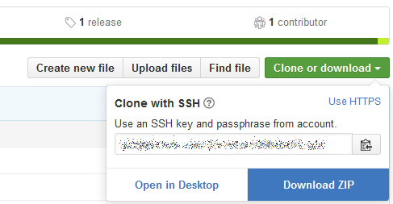

# Software Setup and Knowledge Requirements
This document outlines all software requirements and knowledge needed prior to the training(s).

---

Your Python training is upcoming and we hope you are getting ready for this learning event. Here are a few things to keep in mind before you arrive and as you prepare for the training:
* Plan to arrive early enough so that we can start on time.
* Bring your own laptop. Make sure you have installed the appropriate software detailed below in the [Requirements](http://github.com/pytrain/setup_and_requirements#requirements) section.
* The tentative [Agenda](http://github.com/pytrain/agenda) is online and will be updated as we make lectures/presentations available.
* Ask questions! Don't be afraid to ask and it only makes this training better with your participation.

### Agenda:

The tentative agenda is located online [here](https://github.com/pytrain/agenda).

### Requirements:

The Python training is based upon the Python 3.x series (with compatibility notes for the Python 2.x series where applicable) using the Anaconda distribution/bundled software. We expect each participant to have the following two pieces of software installed on their laptops at least the day before the training begins:

1. Anaconda Python Distribution 

  Anaconda offers a bundled distribution of Python along with many utilities for use in the scientific/engineering disciplines. This software is available at

  [https://www.anaconda.com/download/](http://www.anaconda.com/download/)

  __Note:__ Please download and use the command-line installer designated for your operation system rather than any graphical installer (do not install Anaconda Navigator please). If you do not know how to use the command-line, please email us for further instructions. Also, at the end of the installation prompts, you are asked to install Microsoft’s VSCode software suite. We will NOT be using this as we will be using the [Jupyter Notebook](http://jupyter.org) that is included in the download.

2. Git - Version Control System

  All presentation materials are kept in a Git repository. To access this repository, you need the Git software available at
[https://git-scm.com/download/](https://git-scm.com/download/)

  We will not be using a Git GUI Client, but rather using Git from within the Jupyter notebook or command line (Git Bash for Windows Users).

  This training repository can be downloaded by issuing the following command (from your terminal or Git Bash - Windows Users) at any time during these trainings:

  ```bash
  git clone repo_name
  ```

  You do not need to have a GitHub account to perform this and obtain the material online. If you would rather download a single snapshot .zip file of the presentations, you can do so via the web browser.
  
  

  As we move along, we may update the presentations to make minor corrections or add content that would be beneficial to your learning. In addition to these, solutions to the exercises will be provided through the Git repository by the end of each day.

  __Note:__ If you download the .zip file, you will not be able to update these files using Git. You will have to re-download the .zip file to obtain the latest presentation and changes.

### Other Information:

Presenters for this training will be:

* Carlos Cruz (carlos.a.cruz at nasa.gov)
* Jules Kouatchou (jules.kouatchou-1 at nasa.gov)
* Brent Smith (brent.smith at nasa.gov)

If you have questions during (or even after) the training, please email any of the above contacts.
